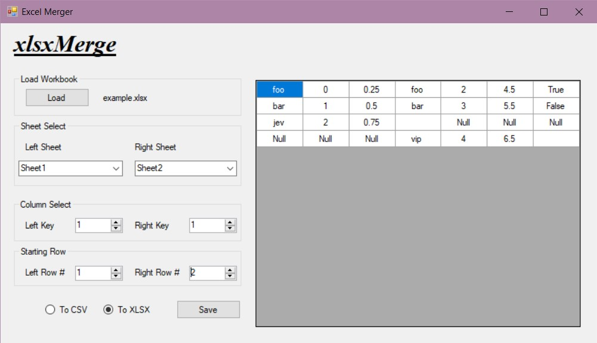

# xlsxMerge
A Simple UI for performing Full Outer Joins on excel spreadsheets perfect for a small business.

## Quick Start

- [Download Microsofts Visual Studio](https://visualstudio.microsoft.com/vs/)
- Open the solution in Visual Studio and [set the project to release mode](https://learn.microsoft.com/en-us/visualstudio/debugger/how-to-set-debug-and-release-configurations?view=vs-2022)
- In the menubar, under *Build*, select *Build Solution* (ctl+sft+b)
- Locate xlsxMerge.exe in your projects director under ./bin/release/
- Run xlsxMerge.exe

## Dependencies

- [Microsoft.Office.Interop.Excel](https://learn.microsoft.com/en-us/dotnet/api/microsoft.office.interop.excel?view=excel-pia)

## User Interface.

#### Tutorial

1. First click *Load* and select your XLSX file.
2. In the dropdowns that appear, select which sheets you would like to merge (note, you can select the same sheet twice).
3. For both sheets, choose which columns you would like to use as primary keys. A key on the left will match with the first instance of the same key on the right. xlsxMerge is greedy and wants an exact match.
4. For both sheets, give which row you would like to start matching from (inclusive). e.g. If you have row headers in row 1 of your xlsx sheet, you may give row 2 as your starting row (ignoring the header row).
5. Verify your output in the feedback window to the right.
6. Click *Save*. This will save your output in your local directory.

## What is a Full Outer Join

To oversimplify, for each cell in ColumnA, *Full Outer Joins* will search ColumnB for matching cells. 
If a match is found, a *Full Outer Join* merges the rows where the match was found into one big row.
If a row is not found, the row will be left in place and *Nulls* will fill the gaps.
Importantly for small buisness applications a Full Join is lossless, meaning that data that failed to match is preseved and added to the output sheet.

##### Left
|      | LeftKey | LeftValue |
|------|---------|-----------|
| Row1 | Foo     | 4         |
| Row2 | Bar     | 5         |

##### Right

|      | RightKey | RightValue |
|------|----------|------------|
| Row1 | Foo      | 15         |
| Row2 | Jip      | 12         |

##### Out

|                | LeftKey | LeftValue | RightKey | RightValue |
|----------------|---------|-----------|----------|------------|
| MatchedRow     | Foo     | 4         | Foo      | 15         |
| UnmatchedLeft  | Bar     | 5         | Null     | Null       |
| UnmatchedRight | Null    | Null      | Jip      | 12         |

## Further Reading

- [I strongly suggest learning the =INDEX(MATCH)) Functions in vanilla excel](https://www.youtube.com/watch?v=F264FpBDX28)
- [See also this excelent python libray for reading and writing in excel](https://openpyxl.readthedocs.io/en/stable/)
